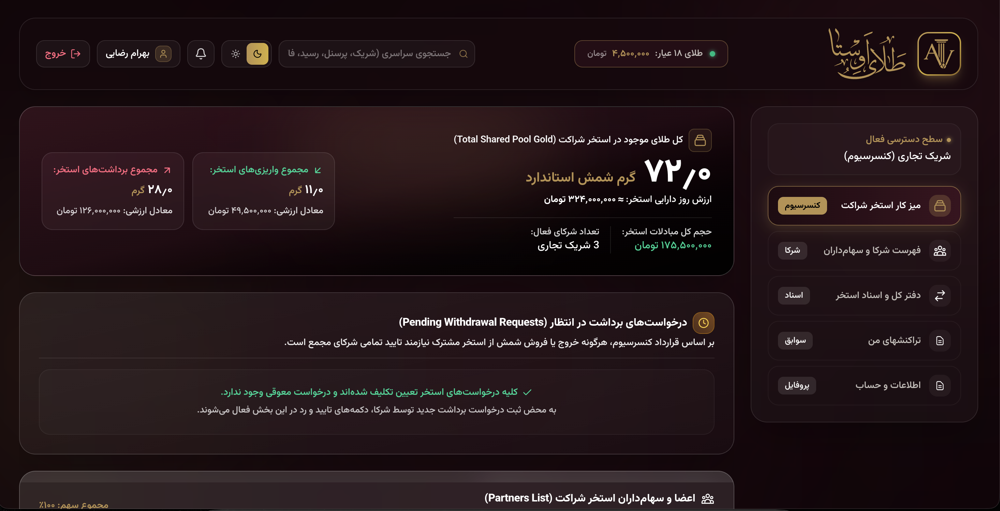
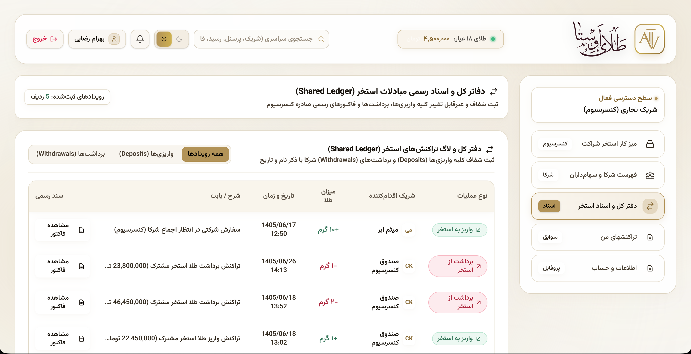

# Hi, I'm Amin 👋

### Python Developer

Python developer focused on building web applications and backend systems with **Django** and the Python ecosystem.

I also work with **JavaScript, React, and Next.js** in real-world projects.

---

## 🛠️ Technologies & Tools

**Backend & Python**

`Python` `Django` `Django REST Framework` `REST APIs`

**Frontend**

`JavaScript` `React` `Next.js` `HTML` `CSS`

**Database & Infrastructure**

`PostgreSQL` `Redis` `Docker` `Nginx` `Linux`

**Tools**

`Git` `GitHub`

---

## 🚀 Featured Projects

### 🛒 Eleman Parts

**E-commerce & Inventory Management Platform**

A production e-commerce platform built with **Django and React**, featuring advanced tools for sales, inventory, pricing, discounts, and business analytics.

**Tech Stack**

`Python` `Django` `React` `JavaScript`
`PostgreSQL` `Redis` `Docker` `Nginx` `Google Analytics`

**Key Features**

* 📊 Sales, profit, purchasing and inventory analytics
* 📦 Inventory and stock management
* 💰 Bulk price updates with category-based control
* 🏷️ Tiered pricing and discount management
* 📱 SMS integration
* 🛍️ Product, category and order management
* 📈 Business performance reporting
* 🚀 Production deployment with Docker and Nginx

🔗 **[Live Website](https://elemanparts.com)**

---

### 🛍️ Mahriz Shop

**E-commerce & Business Management Platform**

A production e-commerce platform developed with **Django and React**, combining online sales with advanced product, pricing, inventory, and business management tools.

**Tech Stack**

`Python` `Django` `React` `JavaScript`
`PostgreSQL` `Redis` `Docker` `Nginx` `Google Analytics`

**Key Features**

* 📊 Sales, profit and inventory analytics
* 📦 Advanced inventory management
* 💰 Category-based bulk price adjustment
* 🏷️ Tiered pricing and discount management
* 📱 SMS integration
* 🛒 Product, order and category management
* 📈 Business reporting and performance tracking
* 🚀 Docker-based production infrastructure

🔗 **[Live Website](https://mahrizshop.com)**

---

### 🪙 Avesta Gold Gallery

**Gold Trading & Partnership Management Platform**

A custom web platform developed for a gold gallery, combining gold trading, digital wallets, partnership management, and business operations within a modern web interface.

**Tech Stack**

`Python` `Django` `Next.js` `React`
`PostgreSQL` `Redis` `Docker` `Nginx`

**Key Features**

* 🪙 Gold buying and selling management
* 👥 Multi-user system for employers and employees
* 🤝 Partnership company management
* 📊 Shared partnership pools with configurable ownership percentages
* 💰 Individual digital wallets
* 🔔 Notifications for partnership withdrawal requests
* 📋 Transaction and financial management
* 🎨 Multiple light and dark themes
* ✍️ Custom typography and visual design system
* ✨ Custom brand identity, logo and UI design

**Design & UI**

The platform features a custom-designed interface with multiple visual themes, custom typography, and a native visual identity created specifically for the project.

**Preview**

**Dark Theme**

**Light Theme**

> ⚠️ **Live website temporarily unavailable — domain is currently under maintenance.**

## 📌 Current Focus

Improving my skills in **Python, Django, backend architecture, API development, and modern web technologies**.

---

## 📫 Contact

**Email:** [aminramezanni@gmail.com](mailto:aminramezanni@gmail.com)
